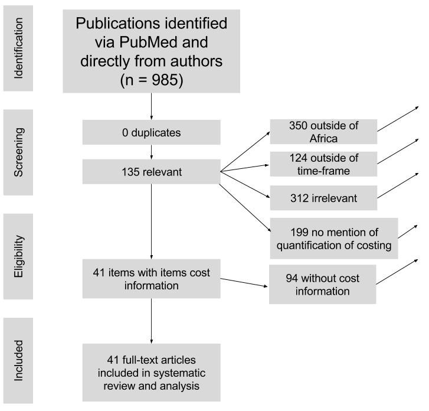

Joe Brew, Christophe Sauboin, Fabien Debailleul, Elisa Sicuri

```{r, echo = FALSE, warning = FALSE, message = FALSE, comment = NA, error= FALSE, cache = FALSE}
# No scientific notation
options(scipen=999)

# Packages 
library(xtable)
library(knitr)
library(ggplot2) 
library(dplyr)
library(rgeos)
library(RColorBrewer)
library(Rmisc)
library(rgdal)
library(raster)
library(sp)
library(leaflet)
library(ggmap)
library(gsheet)
library(Hmisc)
library(maps)
library(rgdal)
library(readr)
library(Hmisc)
library(ggthemes)
library(mgcv)
library(rasterVis)
library(broom)
library(maptools)

# Basic knitr options
opts_chunk$set(comment = NA, 
               echo = FALSE, 
               warning = FALSE, 
               message = FALSE, 
               error = TRUE, # Render report, even with errors
               cache = F)

```

```{r setup, include=FALSE, echo = FALSE}
library(knitr)
knit_engines$set(asis = function(options) {
  if (options$echo && options$eval) knit_child(text = options$code)
})
```


```{r}
# Functions
source('helpers.R')

# Read in PPP data, downloaded from https://raw.githubusercontent.com/datasets/ppp/master/data/ppp-gdp.csv
ppp <- read_csv('ppp.csv')

#### READ IN AND CLEAN UP DATA
# Get link of master spreadsheet of vaccination costs
if('already_read.RData' %in% dir()){
  load('already_read.RData')
} else {
  url_data <- 'https://docs.google.com/spreadsheets/d/1inbYJUdu5uMC0pJOJAA25QCUZ6xFyvWmldjChWlGZok/edit?usp=sharing'
  url_papers <- 'https://docs.google.com/spreadsheets/d/1If4C6jECPifBweOCsdlQm4E7pC3xTf_B_Blt2ufWYQo/edit?usp=sharing'
  
  # Read in as dataframe
  df <- gsheet2tbl(url_data)
  papers <- gsheet2tbl(url_papers)
  
  
  # CLEAN UP LIST OF PAPERS
  # Sort by malaria status
  papers$has_malaria <- 
    grepl('malaria', tolower(papers$abstract)) | grepl('malaria', tolower(papers$title))
  
  # Remove those that we're not including
  papers <-
    papers %>%
    filter(included_in_db %in% c('yes', 'Yes', 'Y', 'y'))
  
  # CLEAN UP DATASET
  df$disease <- toupper(df$disease)
  df$type <- Hmisc::capitalize(tolower(df$type))
  # Re-categorize for transportation
  df$type <-
    ifelse(df$type %in% c('Cold chain',
                          'Cold storage',
                          'Distribution',
                          'Storage and transportation',
                          'International handling'),
           'Transportation', 
           df$type)
  # Re-catgorize for administration
  df$type <- ifelse(df$type %in% c('Delivery',
                                   'Handling',
                                   'Logistic',
                                   'Introduction cost',
                                   'Monitoring',
                                   'Operational cost'),
                    'Administration',
                    df$type)
  # Re-categorize for human resources
  df$type <- ifelse(df$type %in% c('Coordination and supervision',
                                   'Management',
                                   'Prevention (including human ressources)',
                                   'Staff'),
                    'Human resources',
                    df$type)
  # Re-categorize for Equipment: Stationary
  df$type <- ifelse(df$type %in% c('Stationery'), 'Equipment', df$type)
  # Remove those which can't be categorized
  df <- df[!df$type %in% c('Everything except vaccine',
                                'Total',
                                'Vaccine'),]
  # Re-categorized for sensitisation
  df$type <- ifelse(df$type %in% c('Sensitation',
                                   'Social mobilization'),
                    'Sensitisation',
                    df$type)
  
  # Clean up country
  df$country <- Hmisc::capitalize(tolower(df$country))
  df$country <-
    ifelse(grepl('Multiple', df$country),
           'Multiple',
           df$country)
  
  # Remove those that aren't in Africa
  df <- df[df$country != 'Brazil',]
  df <- df[!df$country %in% c('India', 'Bangladesh', 'Cambodia'),]
  
  # Get currency conversion for foreign currencies
  df$currency <- toupper(df$currency)
  currency <- read.csv('currency.csv', header = TRUE )
  currency <- currency[,c(4,5,6)]
  names(currency) <- c('currency', 'date', 'value')
  currency$date <- as.Date(substr(currency$date, 1, 10))
  currency <- currency 
  df$date <- as.Date(paste0(df$year, '-06-01'))
  df <- left_join(x = df,
                 y = currency,
                 by = c("currency", "date"))
  
  # Get currency conversion for USD (ie, for inflation)
  # Using http://data.bls.gov/cgi-bin/cpicalc.pl
  inflation <- read_csv('usd_inflation.csv')
  inflation$date <- as.Date(paste0(inflation$year, '-06-01'))
  inflation$year <- NULL
  
  # First convert from local to USD
  df$usd <- 
    ifelse(!df$currency %in% c('USD', 'PERCENTAGE'),
           df$cost / df$value,
           ifelse(df$currency == 'USD',
                  df$cost,
                  NA))
  
  # Now convert from USD to 2016 USD
  names(inflation) <- c('value_2016', 'date')
  df <- df %>% 
    left_join(inflation,
              by = 'date')
  df$usd_2016 <-
    ifelse(df$currency == 'PERCENTAGE',
           NA,
           df$usd * (df$value_2016/100))
  
  # Adjust for dose number
  df$usd_2016 <- df$usd_2016 / df$doses
  
    # Convert percentages to overall values
  x <- df %>%
    dplyr::filter(currency != 'PERCENTAGE') %>%
    dplyr::group_by(country, source) %>%
    dplyr::summarise(avg = mean(usd_2016),
                     items = length(type)) %>%
    ungroup %>%
    dplyr::summarise(avg_item_cost = mean(avg))
  average_overall_cost <- x$avg_item_cost * length(unique(df$type))
  
  df$estimated_from_percentage <-
    ifelse(is.na(df$usd_2016), TRUE, FALSE)
  
  df$usd_2016 <-
    ifelse(is.na(df$usd_2016),
           (df$cost/100) * average_overall_cost,
           df$usd_2016)
  
  # Clean up column names
  df <- 
    df %>%
    dplyr::select(disease,
                  doses,
                  type,
                  source,
                  source,
                  link,
                  year,
                  country,
                  usd_2016) %>%
    dplyr::rename(cost = usd_2016)
  
  # Remove the one very high HIV human resources study (> 3 sd)
  df <- df %>% 
    dplyr::filter(cost < 30)
  
  # World Bank GDP data
  gdp <- read_csv('gdp_per_capita.csv', skip = 4)
  gdp <- gdp[,c(1, 5:60)]
  gdp <- tidyr::gather(gdp, year, gdp, `1960`:`2015`)
  
  africa_gdps <- gdp
  
  # Keep only those countries in our data
  ins <- rep(NA, nrow(gdp))
  for (i in 1:nrow(gdp)){
    ins[i] <-
      grepl(tolower(gdp$`Country Name`[i]), 
        paste0(tolower(sort(unique(df$country))), collapse = ' '))
  }
  gdp <- gdp[ins,]
  
  # Make nicer title
  gdp$Country <- gdp$`Country Name`
  
  # Make year numeric
  gdp$year <- as.numeric(as.character(gdp$year))
  
  # Join to df
  df <- left_join(x = df,
                  y = gdp %>%
                    dplyr::rename(country = Country),
                  by = c('country', 'year'))
  
  # Get GDP in years that aren't known
  for (i in 1:nrow(df)){
    if(is.na(df$gdp[i])){
      the_country <- df$country[i]
      the_year <- df$year[i]
      has_any_gdp <- the_country %in% sort(unique(gdp$Country))
      if(has_any_gdp){
        sub_gdp <- gdp %>% filter(Country == the_country,
                                  !is.na(gdp))
        keepers <- which.min(abs(the_year - sub_gdp$year))
        df$gdp[i] <-
          mean(sub_gdp$gdp[keepers])
      } else {
        # Just get mean for mean year
        df$gdp[i] <- gdp %>% 
          filter(year == the_year) %>%
          group_by(Country) %>% 
          summarise(gdp = first(gdp)) %>% 
          summarise(x = mean(gdp)) %>% as.numeric
      }
    }
  }
  
  # Get gdps for all countries
  africa_gdps <-
    africa_gdps %>%
    mutate(Country = `Country Name`) %>%
    group_by(Country) %>%
    filter(year == max(year)) %>%
    ungroup
  
  # Map of Africa
  africa <- readOGR('africa_shp', 
                    'AfricanCountires',
                    verbose = FALSE)

  # Get latitude longitude
  africa@data$lng <- coordinates(africa)[,1]
  africa@data$lat <- coordinates(africa)[,2]
  
  # Smaller africa
  africa_small <- thinnedSpatialPoly(SP = africa,
                                     minarea = 0,
                                     tolerance = 5)
  
  # Define whether it's a trial or not
  df$trial <- grepl('trial|Trial|TRIAL', df$source)
  df$introduction <- grepl('introduc|Introduc|INTRODUC', df$source)
  
  # Fortify africa
  africa_fortified <- fortify(africa, by = 'OBJECTID', region = 'COUNTRY')
  
  # Save an image
  save.image('already_read.RData')
}

# Fuzzy match the country names

fuzzy <- cism::fuzzy_match(x = sort(unique(ppp$Country)),
                           y = sort(unique(df$country)))
```

```{r, fig.height = 9}
cols <- colorRampPalette(brewer.pal(9, 'Reds')[3:9])(nrow(africa_small))
cols <- sample(cols)
cols <- adjustcolor(cols, alpha.f = 0.8)
plot(africa_small, col = cols, border = NA)
```


# Introduction  

## Context

This document provides an overview of the GSK malaria immunisation costing estimation. This project is being carried out under the direction of Dr. Elisa Sicuri. Its purpose is to provide country-specific estimates for the non-vaccine costs of implementing large-scale malaria immunisation across sub-saharan Africa. It is considered a "work in progress" and is intended for further review and revisions prior to publication.

## Justification

Given that the a truly large-scale Malaria vaccination campaign has _never_ taken place, it is impossible to know Malaria immunisation unit costs through direct prior experience. However, it is possible to estimate these costs indirectly by gathering data on the costs of other vaccination campaigns over the last two decades.  

This study aims to estimate the non-vaccine costs of widespread Malaria vaccination implementation across Africa via the collection, itemization and standardization of vaccine cost studies in the literature. Its results provide estimates of _likely_ costs to be incurred by Malaria immunisation programmes.

# Methods

## Data collection

### Search strategy

For the purposes of both transparency and future reproducibility, we use a standard and automated search strategy. Our time frame of interest is 2000 to present day (June, 2016). Our search query is `"'((vaccine) OR (vaccination) OR (immunization)) AND (cost) AND (africa)'"`. The code for retrieving the papers and abstracts from PubMed (in the `"R"` programming language) is available [here](https://github.com/joebrew/gsk/blob/master/search_pubmed.R).

## Data aggregation and cleaning

### Itemization and data extraction

Having finished selection, we extract from each study the itemized costs of immunization, excluding the actual purchase of vaccine. The categories are:

- Equipment: Materials and supplies, such as syringes, needle disposal boxes, bandages, paper, etc.

- Human resources: All human labor costs, including salary and wages.

- Sensitisation: All public awareness, advertising or other opinion-influencing actiity.

- Training: Education and training for programme personnel, other than that which they would have already received independely of programme existence.

- Transportation: All costs associated with moving vaccine and/or personnel and/or supplies for the vaccination campaign, including (but not limited to) cold storage.

- Wastage: Any non-productive cost.

- Administration: All non-vaccine, non-material, and non-personnel costs related to the actual delivery of the vaccine, once at a health facility or other site of immunisation, not covered in any of the below categories.


In some cases, all of the above items were available. In most, only some of them were disclosed. In many cases, costs were given as a percentage of total, rather than in currency. 

### Cost types

Studies variably reported cost "types" such as fixed, in-kind, recurring, start-up, variable, etc. These categories were often overlapping and incompatible. They are intentionally excluded due to the lack of comparability across studies.

By the same token, a minority of studies noted, albeit indirectly, the distinction between economic and financial costs. To the extent that this distinction was infrequent and inconsistent, it is also ignored.

We distinguished between "trial" studies (also referred to as "campaign" or "non-routine"), and those implementing more regularly administered vaccines (referred to simply as "routine") Likewise, we distinguished between studies pertaining to the "introduction" of a vaccine in an area for the first time, versus those that pertained to costing of a vaccine that was already in place, ie "non-introduction".

Among our studies, all trial costs happened to be from non-introduction studies (ie, they were trials of a vaccine that was already used in some shape or form), whereas non-trial studies where sometimes introductory in nature (approximatey 1/3 of non-trial studies) and the majority was non-introductory.

### Final inclusion dataset

After selection, we itemized our data into article-cost type pairings.

The raw itemized data is below:

```{r}
x <- df %>% arrange(source)
names(x) <- toupper(names(x))
prettify(x)
```


### Currency standardization

Following itemization, we standardize all costs from local currencies and past values to the equivalent of 2016 United States Dollars. For currency conversion from local to US dollars, we use publicly available exchange rates from [Quandl](https://www.quandl.com/collections/usa/usa-currency-exchange-rate). 

```{r, eval = TRUE, results = 'hide'}
x <- currency %>%
  filter(grepl('-01-01', date))
x <- x %>% arrange(date)
names(x) <- c('Currency', 'Date', 'Cost of 1 USD')
prettify(x)
```

For inflation adjustment, we use the "Consumer Price Index" from the [United States Bureau of Labor and Statistics](http://data.bls.gov/cgi-bin/cpicalc.pl). 


```{r, eval = TRUE}
x <- inflation %>%
    mutate(year = format(date, '%Y')) %>%
  dplyr::select(year, value_2016) %>%
  dplyr::rename(`2016 USD %` = value_2016,
         `Date` = year)
prettify(x)
```

All costs reported herein are in 2016 US Dollars.

### Purchasing price parity

We also adjust currency for purchasing price parity, as estimated by the World Bank [@wbdata]. For our purposes, "adjustment" refers to the process by which we convert from local currency to 2016 USD in PPP. In many cases, this meant "back-engineering" the local currency, since original papers often report in USD.

Below is a table of the PPP values used for this conversion. Full code for the "back-engineering" is available on this paper's github repository [@brew].
```{r}
prettify(tidyr::spread(ppp %>%
                              filter(Year >= 2000) %>%
                              mutate(PPP = round(PPP, 2)), 
                            key = Year, 
                            value = PPP) %>%
  dplyr::select(-`Country ID`)) 
```

```{r}
# Create a table of country, currency, so as to calculate PPP
cc <- 
  data_frame(country = c('Benin',
                        'Burkina faso',
                        'Chad',
                        'Egypt',
                        'Ethiopia',
                        'Gambia',
                        'Ghana',
                        'Ghana and benin',
                        'Guinea',
                        'Kenya',
                        'Kenya and uganda',
                        'Malawi',
                        'Mozambique',
                        'Multiple',
                        'Senegal',
                        'South africa',
                        'Tanzania',
                        'Uganda',
                        'Zambia'),
             currency = c('XOF',
                          'XOF',
                          'XAF',
                          'EGP',
                          'ETB',
                          'GMD',
                          'GHS',
                          'GHS',
                          'GNF',
                          'KES',
                          'KES',
                          'MWK',
                          'MZN',
                          'USD',
                          'XOF',
                          'ZAR',
                          'TZS',
                          'UGX',
                          'ZMW'))

# Create a table for matching countries between ppp and df
ppp_df <-
  data_frame(country = c('Benin',
                        'Burkina faso',
                        'Chad',
                        'Egypt',
                        'Ethiopia',
                        'Gambia',
                        'Ghana',
                        'Ghana and benin',
                        'Guinea',
                        'Kenya',
                        'Kenya and uganda',
                        'Malawi',
                        'Mozambique',
                        'Multiple',
                        'Senegal',
                        'South africa',
                        'Tanzania',
                        'Uganda',
                        'Zambia'),
             new_country = c('Benin',
                        'Burkina Faso',
                        'Chad',
                        'Egypt, Arab Rep.',
                        'Ethiopia',
                        'Gambia, The',
                        'Ghana',
                        'Ghana',
                        'Guinea',
                        'Kenya',
                        'Kenya',
                        'Malawi',
                        'Mozambique',
                        'United States',
                        'Senegal',
                        'South Africa',
                        'Tanzania',
                        'Uganda',
                        'Zambia'))

# Join the currencies to the dataframe
df <- 
  left_join(df,
            cc)

# Clean up currency
currency <-
  currency %>%
              mutate(year = as.numeric(substr(date, 1, 4))) %>%
              dplyr::select(-date) %>%
              dplyr::rename(exchange_rate = value) 
currency <-
  currency %>%
  dplyr::group_by(currency, year) %>%
  dplyr::summarise(exchange_rate = mean(exchange_rate, na.rm = TRUE)) %>%
  ungroup
  

# Get the exchange rate
df <-
  left_join(df,
            currency)

# If no currency for that year, get the oldest value
for (i in 1:nrow(df)){
  if(is.na(df$exchange_rate[i])){
    this_currency <- df$currency[i]
    if(this_currency != 'USD'){
          oldest_value <- currency %>% filter(currency == this_currency) %>% filter(year == min(year)) %>% .$exchange_rate
    df$exchange_rate[i] <- oldest_value
    }
  }
}
df$exchange_rate <-
  ifelse(df$currency == 'USD', 
         1,
         df$exchange_rate)


df <- df %>%
  left_join(ppp_df)


# Join ppp to df
df <-
  left_join(df,
            ppp %>%
              dplyr::rename(country = Country,
                            year = Year) %>%
              dplyr::select(-`Country ID`),
            by = c('new_country'='country',
                   'year'='year'))

# Calculate ppp adjusted USD
df$ppp_adjustment <- df$exchange_rate / df$PPP

# Adjust all values for this
df$cost_ppp <- df$cost / df$ppp_adjustment

```

### Dose standardization

Some papers reported costs per fully immunized person (ie, multiple doses), whereas others reported per dose. For the sake of comparability, all costs were converted to be per dose.

## Data analysis

### Point estimates and distributions

Having gathered and standardized item-specific vaccination programme costs, we estimate ranges for each item cost. Given the incompatibility of currency and percentage data, whenever possible we convert percentage data to 2016 USD, using available data to estimate overall cost. Additionally, since the range of estimates is high, we include distributions in all visualizations.

### Geospatial determinants of vaccine cost

Having estimated the cost of vaccine implementation after standardization for time and currency, we can construct a continuous interpolated surface (raster) for vaccine cost. This allows us to generate country and region-specific estimates. We construct this surface through the use of a generalized additive model (GAM) using bivariate adaptive smoothing for the spatial (latitude and longitude) inputs. This method employs "basis penalties" to estimate the spatial effect on cost without overfitting to each country's location, and is useful in estimating spatial effects with incomplete information [@Wheeler2015, @Li2012, @Young2010, @French2004].

The rationale for using a spatial model to estimate costs is two-fold. First, a spatial model has the advantage of capturing simply geopolitical, cultural and economic characteristics which are difficult to observe or quantify or would lead to such a wide-dimensioned model so as to be unstable. Second, a smoothed spatial model allows for generalizability to other locations within the range of the model's training locations (ie, Sub-Saharan Africa).

Given that most studies are at the regional and national levels, country centroids are used for locations. Sub-national breakdowns are not taken into consideration.


### Modeling

In addition to the country- and region-specific implementation costs estimation, we estimate the effect of macroeconomic factors (GDP per capita) on costs. Though GDP per capita is geospatially autocorrelated, we apply a flexible smoothing algorithm to location, whereas we carry out no smoothing for GDP. We include these determinants into a final generalized additive model, which will be applicable for cross-continent cost estimation.

# Results

## Item selection

The initial query returned 985 results. We read the abstracts of all 985 papers, and eliminated 850 due to any of the following reasons:

- Geographic incompatibility (outside of sub-saharan Africa)
- Temporal incompatibility (outside of the time range in question)
- Subject matter irrelevance (non-human or animal vaccines, non-vaccines, opinion pieces, etc.)
- Lack of quantitative costing information

All 985 "original" papers, prior to manual exclusion, can be obtained [here](https://github.com/joebrew/gsk/blob/master/pubmed_results.csv?raw=true).

The first elimination round left 135 articles for manual inspection. All were read, and a further 94 were eliminated because they lacked itemized cost information, cost information was not clear, or the items listed were not categorized in a way as to make comparable to the larger body of literature.

The below diagram shows the flow of article selection:

<div>

</div>


### Selected studies

Below is a complete overview of all `r nrow(papers)` studies that both matched the automated selection criteria _and_ passed the manual filtering steps outlined above.

```{r}
temp <- papers %>%
  dplyr::select(title,
                year, 
                affiliation,
                all_authors,
                url)
names(temp) <- capitalize(gsub('_', ' ', names(temp)))
prettify(temp)
```

A full list is available in the appendix.

## Item-specific vaccination implementation estimates

The number of articles reporting specific costs for each category of item costs can be visualized below.

```{r}
x <- df %>%
  group_by(Item = type) %>%
  dplyr::summarise(Articles = length(unique(source)))

ggplot(data = x,
       aes(x = Item, y = Articles)) +
  geom_bar(stat = 'identity',
           fill = 'darkred', alpha = 0.6) +
  theme_economist() +
  theme(axis.text.x = element_text(angle = 90, hjust = 1))
```

What follows is a table of the same data

```{r}
prettify(x)
```


A total of `r length(unique(df$country))` country combinations were included in the final dataset. Their distribution can be visualized below.

```{r}
x <- df %>%
  group_by(country) %>%
  dplyr::summarise(n = length(unique(source))) %>%
  arrange(desc(n))
x$country <- factor(x$country, levels = x$country)
ggplot(data = x,
       aes(x = country,
           y = n)) +
  geom_bar(stat = 'identity',
           fill = 'darkred',
           alpha = 0.6) +
  theme_economist() +
  xlab('Country') +
  ylab('Studies') +
  theme(axis.text.x = element_text(angle = 90, hjust = 1))
```

Below is a table of the same data.

```{r}
names(x) <- c('Country', 'Articles')
prettify(x)
```


What follows are charts showing the distribution of dose-specific costs (both in currency and extrapolated from percentages) for each of the 7 implementation categories. The vertical line shows the average cost.


```{r}
# Define function for charting distribution of costs based on type
type_chart <- function(this_type,
                       ppp = FALSE){
  temp <- df %>% filter(type == this_type)
  
  if(ppp){
    g <- ggplot(data = temp,
                aes(x = cost_ppp))
    xl <- '2016 US PPP-adjusted Dollars'
    st <- 'Average PPP-adjusted cost of '
    the_mean <- mean(temp$cost_ppp)
  } else {
    g <- ggplot(data = temp,
              aes(x = cost))
    xl <- '2016 US Dollars'
    st <- 'Average cost of '
    the_mean <- mean(temp$cost)
  }
  
  g <- g +
    geom_density(fill = 'darkred', alpha = 0.5) +
    theme_economist() +
    xlab(xl) +
    ylab('Density') +
    geom_vline(xintercept = the_mean, lty = 2) +
    ggtitle(this_type) +
    labs(subtitle = paste0(st, round(the_mean, digits = 2)))
  return(g)
}

type_chart_panel <- function(){
  g <- ggplot(data = df,
                aes(x = cost_ppp))
  xl <- '2016 US PPP-adjusted Dollars (log-scale)'
  g <- g +
    geom_density(fill = 'darkred', alpha = 0.5) +
    theme_economist() +
    xlab(xl) +
    ylab('Density') +
    # geom_vline(aes(xintercept = mean(cost_ppp)), lty = 2) +
    facet_wrap(~type) +
    scale_x_log10()
  g
}

```

### Administration

The average administration cost per dose was close to \$2 USD, with half of studies having an administration cost of less than \$0.53.

```{r}
type_chart('Administration')
type_chart('Administration',
           ppp = TRUE)

```

 ### Equipment
 
 The distribution of equipment costs observed in studies was distinctly bi-model. 6 of the 9 studies which reported equipment had a cost of less than \$0.30 USD; the other 3 ranges from \$0.73 to \$3.43. The wide wariance may be explained due to different studies having different (unreported) definitions of what constitutes equipment.

```{r}
type_chart('Equipment')
type_chart('Equipment', ppp = TRUE)
```

 ### Human resources

Costs for human resources varied widely, but the distribution is distinctly left-skewed, with half of studies reporting human resources costs of less than \$2.52. We can attribute to trial or non-routine expenditures the fact that several studies were such outliers; on the contrary, the two most expensive studies in terms of human resources where routine, non-introduction immunization campaigns, a fact which suggests that inclusion criteria for what constitutes "human resources costs" likely differed from study to study.

```{r}
type_chart('Human resources')
type_chart('Human resources', ppp = TRUE)
```

### Sensitisation

Sensitisation costs were low across all studies. One outlier - an oral cholera vaccine campaign in urban Mozambique - reported particularly high costs, but 90% of studies reported sensitisation costs of \$0.20 or less.

```{r}
type_chart('Sensitisation')
type_chart('Sensitisation', ppp = TRUE)
```

 ### Training
 
Training costs were low across all studies The highest training costs were associated with programs in which a new vaccine was introduced alongside another into an already existing national program.

```{r}
type_chart('Training')
type_chart('Training', ppp = TRUE)
```

 ### Transportation

We observed wide variance in transporation costs. Though half of studies had costs of less than \$0.67 USD, several studies had costs of more than \$1 USD (and in one case, nearly \$20 USD). The cause for this variation is not clear.

```{r}
type_chart('Transportation')
type_chart('Transportation', ppp = TRUE)
```

 ### Wastage

Wastage costs varied widely per study. Those with the highest costs involved Hepatitis B or jet injection vaccinations.

```{r}
type_chart('Wastage')
type_chart('Wastage', ppp = TRUE)
```


The below table shows the same costs.

```{r}
x <- df %>%
  dplyr::group_by(Item = type) %>%
  dplyr::summarise(Average = round(mean(cost), digits = 2),
                   Maximum = round(max(cost), digits = 2),
                   Minimum = round(min(cost), digits = 2),
                   articles = length(unique(source)))
prettify(x)
```


The below table is identical to the above, but using PPP-adjusted costs

```{r}
x <- df %>%
  dplyr::group_by(Item = type) %>%
  dplyr::summarise(Average = round(mean(cost_ppp), digits = 2),
                   Maximum = round(max(cost_ppp), digits = 2),
                   Minimum = round(min(cost_ppp), digits = 2),
                   articles = length(unique(source)))
prettify(x)
```


### Differences in cost estimations

Despite both quantitative and qualitative components to our analysis of which factors might account for the large differences in costs, we are unable to make conclusions in this area. Due to a lack of standardization in both (a) what is reported (some studies report all of the cost types we mention, others only a portion) and (b) how it is reported, studies are not directly comparable. Evidence for this exists in the below bar chart, showing the maximum cost for each expenditure type as a percentage of the minimum cost in the same category. Though some variance is to be expected, we suspect that much of the variance observed is not due to actual differences in cost, but rather due to differences in what is reported in each cost category.


```{r}
x <- df %>% 
  mutate(cost = ifelse(cost == 0, NA, cost)) %>%
  group_by(type) %>% 
  dplyr::summarise(x = max(cost, na.rm = T) / 
                     min(cost, na.rm = T) * 100) %>%
  arrange(x) %>%
  mutate(type = factor(type, levels = type))

ggplot(data = x,
       aes(x = type,
           y = x)) +
  geom_bar(stat = 'identity',
           alpha = 0.6,
           fill = 'darkred') +
  scale_y_log10() +
  labs(x = 'Type of expenditure',
       y = 'Variance (log scale)',
       title = 'Variance in costs by type',
       subtitle = 'Maximum observed cost as percentage of minimum') +
  theme(axis.text.x = element_text(angle = 90)) +
  theme_economist()
```


### Cost per dose by campaign type

In an effort to better understand the wide variance between costs, we examined the effect of campaign type. Surprisingly, we found that routine vaccination campaigns had higher reported costs than trial campaigns. We attribute this fact to the likely under-reporting and non-reporting of those costs which trials often consider "in-kind". In other words, we suspect that those economists who costed "routine" programs were more likely to be thorough and comprehensive in accounting for all costs than those who costed introductory programs (who were more likely to focus more only on those costs which differed from the "routine" program).

```{r}
x <- df %>%
  dplyr::mutate(trial = ifelse(trial, 'Trial', 'Routine'),
         introduction = ifelse(introduction, 'Introductory', 'Not introductory')) %>%
  dplyr::mutate(campaign_type = paste0(trial, '-', introduction)) 
fit <- lm(cost ~ type + campaign_type, data = x)
ci <- confint(fit)
ci <- broom::tidy(ci)
ci$mid <- coef(fit)

# Make a dataframe for predicting
fake_df <- data_frame(type = 'Wastage',
                      campaign_type = c('Routine-Introductory',
                                        'Routine-Not introductory',
                                        # 'Trial-Introductory',
                                        'Trial-Not introductory'))
fake_df$predicted <- predict(fit, fake_df) - coef(fit)['typeWastage']

ggplot(data = fake_df,
       aes(x = campaign_type,
           y = predicted)) +
  geom_bar(stat = 'identity',
           alpha = 0.6,
           fill = 'darkred') +
  labs(x = 'Campaign type',
       y = 'Cost',
       title = 'Estimated cost contribution of campaign type',
       subtitle = '2016 USD') +
  theme_economist()
```

We run the same estimations for PPP-adjusted costs to produce the below.


```{r}
x <- df %>%
  dplyr::mutate(trial = ifelse(trial, 'Trial', 'Routine'),
         introduction = ifelse(introduction, 'Introductory', 'Not introductory')) %>%
  dplyr::mutate(campaign_type = paste0(trial, '-', introduction)) 
fit <- lm(cost_ppp ~ type + campaign_type, data = x)
ci <- confint(fit)
ci <- broom::tidy(ci)
ci$mid <- coef(fit)

# Make a dataframe for predicting
fake_df <- data_frame(type = 'Wastage',
                      campaign_type = c('Routine-Introductory',
                                        'Routine-Not introductory',
                                        # 'Trial-Introductory',
                                        'Trial-Not introductory'))
fake_df$predicted <- predict(fit, fake_df) - coef(fit)['typeWastage']

ggplot(data = fake_df,
       aes(x = campaign_type,
           y = predicted)) +
  geom_bar(stat = 'identity',
           alpha = 0.6,
           fill = 'darkred') +
  labs(x = 'Campaign type',
       y = 'Cost',
       title = 'Estimated cost contribution of campaign type',
       subtitle = 'PPP-adjusted 2016 USD') +
  theme_economist()
```


### Admnisistrative cost per campaign type

An examination of the average administrative cost per campaign type adds evidence to the above hypothesis.

```{r}
y <- x %>%
  dplyr::filter(type == 'Administration') %>%
  dplyr::group_by(campaign_type) %>%
  dplyr::summarise(cost = mean(cost))

ggplot(data = y,
       aes(x = campaign_type,
           y = cost)) +
  geom_bar(stat = 'identity', alpha = 0.6,
           fill = 'darkred') +
  labs(x = 'Campaign type',
       y = 'USD',
       title = 'Administration cost by campaign type',
       subtitle = '') +
  theme_economist()
```

The below is the same data, but using PPP-adjusted costs.


```{r}
y <- x %>%
  dplyr::filter(type == 'Administration') %>%
  dplyr::group_by(campaign_type) %>%
  dplyr::summarise(cost = mean(cost_ppp))

ggplot(data = y,
       aes(x = campaign_type,
           y = cost)) +
  geom_bar(stat = 'identity', alpha = 0.6,
           fill = 'darkred') +
  labs(x = 'Campaign type',
       y = 'USD',
       title = 'Administration cost by campaign type',
       subtitle = '') +
  theme_economist()
```


## Aggregate cost estimation

In order to estimate the average overall (non-vaccine) implementation cost per dose, we can run a Monte Carlo simulation. Performing 10,000 resamplings, we arrive at a distribution of the likely overall cost.

```{r}
n <- 10000
types <- sort(unique(df$type))
length_types <- length(types)
x <- data.frame(costs = rep(NA, n))
x_ppp <- x
for (j in 1:length(types)){
  x[,types[j]] <- NA
  x_ppp[,types[j]] <- NA
}
for (i in 1:length(x$costs)){
  this_sample <- rep(NA, length_types)
  this_sample_ppp <- rep(NA, length_types)
  for (j in 1:length(types)){
    sample_from_these <- df$cost[df$type == types[j]]
    sample_from_these_ppp <- df$cost_ppp[df$type == types[j]]
    this_sample[j] <- sample(sample_from_these, 1)
    this_sample_ppp[j] <- sample(sample_from_these_ppp, 1)
    x[i,types[j]] <- this_sample[j]
    x_ppp[i,types[j]] <- this_sample_ppp[j]
  }
  x$costs[i] <- sum(this_sample, na.rm = TRUE)
  x_ppp$costs[i] <- sum(this_sample_ppp, na.rm = TRUE)
}
```

```{r}
ggplot(data = x,
       aes(x = costs)) +
  geom_density(fill = 'darkgreen', alpha = 0.6) +
  theme_economist() +
  xlab('2016 USD') +
  ylab('Density') +
  ggtitle('Total non-vaccine cost estimation') +
  geom_vline(xintercept = mean(x$costs, na.rm = TRUE), lty = 2) +
  labs(subtitle = paste0('Average cost of ', round(mean(x$costs, na.rm = TRUE), digits = 2)))
```

The below is the same visualization, using PPP-adjusted costs.

```{r}
ggplot(data = x_ppp,
       aes(x = costs)) +
  geom_density(fill = 'darkgreen', alpha = 0.6) +
  theme_economist() +
  xlab('2016 USD') +
  ylab('Density') +
  ggtitle('Total non-vaccine cost estimation') +
  geom_vline(xintercept = mean(x_ppp$costs, na.rm = TRUE), lty = 2) +
  labs(subtitle = paste0('Average PPP-adjusted cost of ', round(mean(x_ppp$costs, na.rm = TRUE), digits = 2)))
```


## Temporal dimensions of vaccine cost

An examination of item-specific costs over time shows no apparent secular trend. Accordingly, temporal data is explicitly ignored by our model.

```{r}
x <- df %>%
  dplyr::group_by(year, type) %>%
  dplyr::summarise(avg = mean(cost))

cols <- colorRampPalette(brewer.pal(9, 'Spectral'))(length(unique(x$type)))

ggplot(data = x,
       aes(x = year,
           y = avg,
           col = type)) +
  geom_line() +
  scale_color_manual(name = 'Item',
                     values = cols) +
  theme_economist() +
  xlab('Year') +
  ylab('Average cost (2016 USD)')
```

What follows is a table of the same data:

```{r}
x$avg <- round(x$avg, digits = 2)
names(x) <- c('Year', 'Item', 'Average cost')
prettify(x)
```

## Geospatial determinants of vaccine cost

Not enough data on item-specific vaccine costs exist in the literature to form a model in which country itself is a stable predictor of cost. However, we can estimate geography's _general_ effect through generalized additive model.

Our model adjusts for item type, and uses a smoothed spatial surface to estimate the spatial effect of costs. The below map shows this effect, with the coloring of the surface reflecting the location-specific contribution to implementatoin cost in 2016 USD (per dose).

```{r, fig.height = 7, fig.width = 8}
x <- df %>%
  dplyr::rename(COUNTRY = country) %>%
  dplyr::left_join(africa@data)

# Get bbox of our countries
lats <- c(min(x$lat, na.rm = TRUE), max(x$lat, na.rm = TRUE))
lngs <- c(min(x$lng, na.rm = TRUE), max(x$lng, na.rm = TRUE))

fit <- gam(cost ~ type + s(lng, lat, bs="ad") + introduction, data = x)

# Save
old_fit <- fit

# Make a plot of africa
fake_africa <- africa@data
fake_africa$type <- 'Administration'
fake_africa$introduction <- TRUE
# Remove north africa
fake_africa <- fake_africa %>%
  filter(lat < 15)

predictions <- predict(fit, fake_africa)

# Make a grid of africa
df_grid <- expand.grid(lng = seq(bbox(africa)[1,1],
                                 bbox(africa)[1,2],
                                 length = 1000),
                      lat = seq(bbox(africa)[2,1],
                                bbox(africa)[2,2],
                                length = 1000))
df_grid$x <- df_grid$lng
df_grid$y <- df_grid$lat
df_grid$type <- 'Administration'
df_grid$introduction <- TRUE
df_grid$prediction <- predict(fit, df_grid)
# Make spatial
coordinates(df_grid) <- ~x+y
proj4string(df_grid) <- proj4string(africa)
# Create raster
# Keep only those within africa
x <- over(df_grid, polygons(africa))
df_grid_small <- df_grid[!is.na(x),]
temp <- df_grid_small@data %>% arrange(lng, lat)
r <- rasterFromXYZ(temp[, c('lng', 'lat', 'prediction')])
# levelplot(r, contour = TRUE) +
  # layer(sp.lines(africa, lwd=0.8, col='white'))

# Remove north africa
plot(r,
     ylim = c(-40, 15))
```

The below table shows model details.

```{r}
summary(fit)
```


## Integration with external data

GDP per capita (scraped from the World Bank's data archives) over time was gathered for all countries from which any study was selected (see below chart).

```{r}
cols <- colorRampPalette(brewer.pal(9, 'Spectral'))(length(unique(gdp$Country)))
g <-
  ggplot(data = gdp,
         aes(x = year,
             y = gdp,
             group = Country,
             color = Country)) +
  geom_line() +
  scale_color_manual(name = 'Country',
                     values = cols) +
  theme_economist() +
  theme(legend.text = element_text(size = 6)) +
  xlab('Year') +
  ylab('GDP per capita') +
  ggtitle('GDP per capita for countries in study')
g
```

Data were paired for each country for the year in which the study was conducted. In the case of studies spanning multiple years, the year for which the currency value was reported in the study was used. The distribution of country-specific GDP per capita values for the final dataset can be visualized below.

```{r}
ggplot(data = df,
       aes(x = gdp)) +
  geom_density(fill = 'darkgreen', alpha = 0.6) +
  xlab('GDP per capita (USD)') +
  ylab('Density') +
  ggtitle('Distribution of per-study GDP per capita values') +
  theme_economist()
```

## Final model

The final model estimates the effect of both space (via smoothed latitude and longitude), weatlh (via GDP per capita), and programme type (routine vs. introduction) on the cost of non-vaccine immunisation programme costs. Estimation is carried out by modeling vaccine type, smoothed location, and GDP via a GAM.

```{r}
# Get overall cost
x <- df %>%
  dplyr::rename(COUNTRY = country) %>%
  dplyr::left_join(africa@data)
fit <- gam(cost ~ type + s(lng, lat, bs="ad") + gdp + introduction, data = x)
```

The model's coefficient estimates (excluding the smoothed bivariate spatial interpolation estimates, which are non-linear) are below.

```{r}
x <- summary(fit)$p.coeff
y <- data.frame(x)
y$item <- row.names(y)
y <- y %>% dplyr::select(item, x)
y$x <- round(y$x, digits = 3)
y$item <- gsub('type|TRUE', '', y$item)
y$item <- Hmisc::capitalize(y$item)
names(y) <- c('Item', 'Coefficient')
row.names(y) <- NULL
prettify(y)
```


Of note in the above table: the cost of introduction (as opposed to routine) vaccination campaigns is greater than $2 USD per dose. Human resources is the greatest expense, while both transportation and wastage also contribute significantly to overall cost.


Model details are below:

```{r}
summary(fit)
```

Ultimately, GDP was not found to be a significant predictor of program cost (p = 0.134). Accordingly, it was removed from the projections model.


```{r}
# Revert to old model
fit <- old_fit
```

## Projections for all of Africa

We can also use our model to project costs per dose for each item onto every Sub-Saharan African country. The below projections assume an "introductory" (as opposed to "routine") campaign, with 2015 GDP and in 2015 currency.

```{r}
countries <- sort(unique(africa@data$COUNTRY))
types <- sort(unique(df$type))

x <- expand.grid(COUNTRY = countries,
                 type = types)
# Get lat long
x <- x %>%
  left_join(africa@data %>%
              filter(!duplicated(COUNTRY)) %>%
              dplyr::select(COUNTRY, lng, lat))

# For those outside of the space for which the model was estimated
# simply replace coordinates with extremes
for (i in 1:nrow(x)){
  if(x$lng[i] < min(lngs)){
    x$lng[i] <- min(lngs)
  }
  if(x$lng[i] > max(lngs)){
    x$lng[i] <- max(lngs)
  }
  
  if(x$lat[i] < min(lats)){
    x$lat[i] <- min(lats)
  }
  if(x$lat[i] > max(lats)){
    x$lat[i] <- max(lats)
  }
}

# Get most recent gdp
x <- x %>%
  left_join(africa_gdps %>%
              dplyr::rename(COUNTRY = Country))

# When not availble, just take mean gdp from df
x$gdp[is.na(x$gdp)] <- mean(df$gdp[!duplicated(df$country)])

# Add introduction
x$introduction <- TRUE

# Make prediction
predictions <- predict(fit, x, se.fit = TRUE)
predictions_df <- data.frame(predicted = as.numeric(predictions$fit),
                             lwr = as.numeric(predictions$fit) - 
                               (as.numeric(predictions$se.fit) * 1.96),
                             upr = as.numeric(predictions$fit) + 
                               (as.numeric(predictions$se.fit) * 1.96))
# Combine
x <- cbind(x, predictions_df)
# Set to 0 anything that is negative
x$predicted[x$predicted < 0] <- 0
x$lwr[x$lwr < 0] <- 0
x$upr[x$upr < 0] <- 0

x <- x %>% dplyr::select(-lng, -lat, -introduction, -gdp)
y <- x
names(x) <- toupper(names(x))

# prettify(x)
```


```{r}

# Group by country and add all together
x <- x %>%
  dplyr::group_by(COUNTRY) %>%
  dplyr::summarise(PREDICTED = sum(PREDICTED))
# prettify(x)
```


```{r}
# Group by item and get all together
y <- y %>%
  dplyr::group_by(type) %>%
  dplyr::summarise(predicted = mean(predicted))
total <- sum(y$predicted)
names(y) <- c('Item', 'Average cost')
# prettify(y)
```

The below map shows overall (all-item) non-vaccine costs across Africa.

```{r, fig.height = 8}
africa@data <- africa@data %>%
  left_join(x)


# Get estimates
africa_fortified <-
  africa_fortified %>%
  left_join(x,
            by = c('id' = 'COUNTRY'))

# Remove north of 16 lat
ggplot(data = africa_fortified) +
  geom_polygon(aes(x = long,
                   y = lat,
                   group = group,
                   fill = PREDICTED),
               color = 'white',
               lwd = 0.2) +
  coord_map() +
  theme_map() +
  # xlab('Longitude') +
  # ylab('Latitude') +
  ggtitle('Country specific total implementation costs') +
  labs(subtitle = 'USD per dose') +
  scale_fill_gradient2(low = 'blue',
                      mid = 'green',
                      high = 'red') +
  ylim(-40, 15)
```


# Discussion

## Main findings 

The principal contribution of this study is the generation of an estimate, based purely on costs in a similar context, of the non-vaccine immunisation programme implementation costs for the roll-out of a Malaria vaccine across Africa. To the authors' knowledge, this is the first study to attempt such a quantification.

## Limitations

This study, and its results, are not without limitations. Chief among them is the small sample size from which estimates were modeled (and, by extension, the corresponding wide confidence intervals). Secondly, lack of comparability of cost types makes the itemizing of costs a somewhat futile exercise. Third, this study assumes that administration of the roll-out of a malaria vaccine will be similar to that of other vaccines (a possible, but by no means certain, scenario). Fourth, we do not delve into dosage, age, or coverage issues. Finally, this study is narrow in scope, only looking at vaccine studies in Africa, and ignoring other areas where Malaria is endemic (Southeast Asia, Central and South America, etc.).

## Further research

Further research is needed, particularly into those factors which determine vaccine programme cost. A particular challenge, and one encountered in this study at multiple points, is the lack of standardisation (and by extension, comparability) among studies. 

For example, whereas in some studies "administration" included personnel (ie, "human resources" costs), others did not. Some studies published wages and salaries, but not the amount of person-time allocated to the programme. The distinction between fixed and variable costs appeared in fewer than half of studies, and many studies made no mention of whether or how they attempted to quantify "in-kind" costs.

To address this issue, we propose to devise and publish (as a separate paper) a "template" of best practices for reporting vaccine cost studies.

# Details

This work was carried out by Elisa Sicuri and Joe Brew, in collaboration with GSK. A debt of gratitude is owed to Celine Aerts, who helped with data collection.

All analysis was carried out in the R programming language in `r R.version$version.string` on a `r R.version$system` system. 

# Appendix

## Final selected papers

```{r}
temp <- papers %>%
  dplyr::select(title,
                year, 
                affiliation,
                all_authors,
                url)
names(temp) <- capitalize(gsub('_', ' ', names(temp)))
# prettify(temp,
#               options = list(pageLength = nrow(temp)))
kable(temp)
```

## Raw itemized data

```{r}
x <- df %>% arrange(source)
names(x) <- toupper(names(x))
kable(x)
```

# References

(Other than those included in the data analysis)

